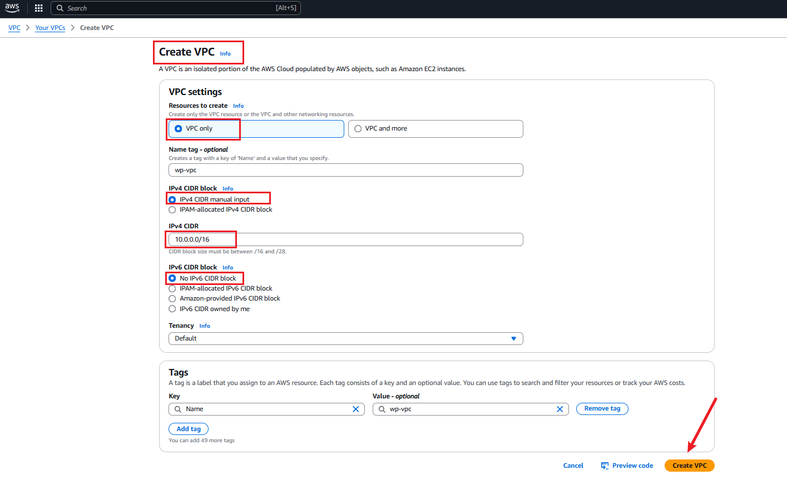
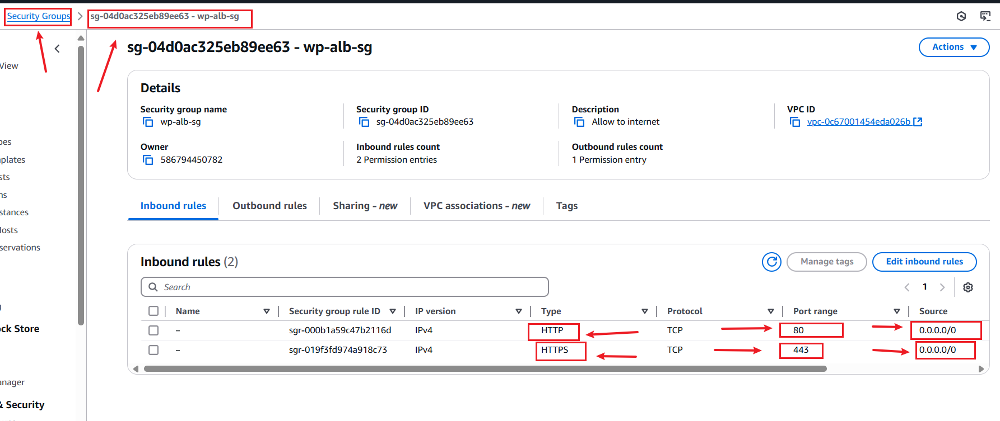

# Capstone Project: Wordpress Site On AWS

## Project Scenerio and Overview

This **Capstone Project: WordPress Site on AWS** involves designing and deploying a scalable, secure, and high-performance WordPress-based website for **DigitalBoost**, a digital marketing agency. The agency seeks a cost-effective solution that can handle increasing traffic while seamlessly integrating with their existing infrastructure.

This project allowed me to apply and reinforce my DevOps knowledge, particularly in leveraging AWS services to deploy a production-ready application. The tasks completed during this project highlight my ability to design and implement robust cloud architectures.

## Why Am I Doing This Project?

This project serves the following purposes:

  1. **Practical Experience:**  To gain hands-on experience in building secure and scalable cloud environments.
  2. **Problem-Solving Skills:** To apply concepts of networking, databases, and load balancing in a real-world scenario.
  3. **Cloud Expertise:** To enhance my proficiency in AWS services and implement best practices for cloud deployments.

By successful completion of this project, I aim to demonstrate my capability to design reliable cloud-based solutions, further establishing my path to becoming a skilled DevOps engineer.

## Tasks completed

To achieve the project goals, I completed the following tasks:

1. **VPC Setup:**

      - Configured a Virtual Private Cloud (VPC) to isolate the project infrastructure securely.

2. **Public and Private Subnet Configuration with NAT Gateway Setup:**

      - Designed and implemented a network architecture with public and private subnets for better security and scalability.

      - Configured a NAT Gateway for secure internet access.  

3. **AWS MySQL RDS Setup:**

      - Created a managed database using Amazon RDS with MySQL to ensure data availability and reliability. 

4. **Setting up Amazon EFS for WordPress:**

      - Configured Amazon Elastic File System (EFS) for scalable, shared file storage.

5. **Application Load Balancer Setup:**

      - Deployed an Application Load Balancer to distribute traffic evenly across instances and improve fault tolerance.

6. **Auto Scaling Group**

      - Configured an Auto Scaling Group to dynamically handle traffic spikes and ensure high availability.


## Resources Used

**AWS Services**

 - **Amazon EC2:** Hosting the WordPress application.

 -  **Amazon RDS:** Managing the MySQL database.

 -  **Amazon EFS:** Providing scalable file storage for WordPress.

 -  **Amazon VPC:** Ensuring network security and isolation.

 -  **Application Load Balancer:** Distributing traffic and improving fault tolerance.

 -  **Auto Scaling Group:** Maintaining high availability during traffic spikes.

 -  **NAT Gateway:** Enabling secure internet access for private subnets.

## WordPress Platform

 - **Content Management System (CMS):** Used to manage and build the WordPress-based website.

## Scripts and Tools

**Automation Scripts** 

  + CloudFormation templates for provisioning AWS infrastructure.

  + Shell scripts for configuring and deploying WordPress components.
## Tools

- **Visual Studio Code (VS Code):** Used for writing, editing, and managing scripts and configuration files efficiently.

-  **AWS Management Console:** For managing and monitoring AWS resources.

-   **Command Line Interface (CLI):** To execute commands and manage AWS services programmatically.

- **Git:** For version control of scripts and templates.

These tools and scripts streamlined the project's development and deployment process, ensuring automation and reproducibility.

**Pre-requisite Knowledge**

   + Concepts from **TechOps Essentials** and foundational DevOps projects.

## Conclusion 

This project has been instrumental in demonstrating my ability to design and deploy a scalable, secure, and cost-effective WordPress site on AWS. It underscores my proficiency in utilizing AWS services and applying industry best practices to deliver reliable cloud-based solutions.

## Project Deliverables

**Documentation:**

 -  **Detailed Documentation:** Comprehensive documentation for each component setup, including configurations and implementation steps.

 -   **Security Measures:** Clear explanation of the security measures implemented to ensure the safety and reliability of the WordPress site.


**Demonstration:**

- **Live Demonstration:** A working demonstration of the WordPress site hosted on AWS, showcasing its functionality and performance.
- **Auto-Scaling Showcase:** Simulation of increased traffic to demonstrate the functionality of auto-scaling and load balancing.

**Project Overview:**

**Screenshot:**


## Task 1: Development on Local Workstation

### Step 1: Implement Version Control with Git

+ Initialize Git Repository.

+ To begin, create the project directory named WordPress-based, navigate into it, and initialize it as a Git repository.

**Note:** For this project, I am using Git Bash on a Windows workstation to execute these shell commands, as it provides a Unix-like command-line experience.

Commands:

```
mkdir WordPress-based
cd WordPress-based
git init
```

## Evaluation Report for the Capstone Project: WordPress Site on AWS

## Task 2: VPC Setup

### VPC ARCHITECTURE

**Screenshot:**


The **Virtual Private Cloud (VPC)** Setup is a critical component of the project, ensuring a secure and scalable environment for hosting the WordPress site. The following steps were performed:

### Step 2.1: IP Address Range Definition

 + Defined the CIDR block for the VPC to allocate private and public IP ranges.

 + Ensured the CIDR block supports scalability and future growth needs.

**Screenshots:**



+ Showing VPC Name, VPC ID, IPv4 CIDR


## Step 2.2: VPC Public and Private Subnet Creation

  + Created the VPC with both public and private subnets to host resources securely.

  + Configured the VPC for high availability and fault tolerance.

**Public Subnets**

**1. WordPress-Based-Public-subnet-1a:**

- **CIDR Block:** 10.0.0.0/24
- **Availability Zone:** us-east-1a


**2. WordPress-Based-Public-subnet-1c:**

   - **CIDR Block:** 10.0.1.0/24   
   - **Availability Zone:** us-east-1c


### Private Subnets
**1. WordPress-Based-Private-subnet-1a:**

- **CIDR Block:** 10.0.2.0/24
- **Availability Zone:** us-east-1a


**2. WordPress-Based-Private-subnet-1c:**

   - **CIDR Block:** 10.0.3.0/24
   - **Availability Zone:** us-east-1c

#### Notes
+ Each subnet is designed to fit within the same VPC for seamless communication.
+ Public subnets are configured to handle traffic from the internet, while private subnets are isolated for backend services.

### Step 2.3: Internet Gateway and Route Table Configuration**

To enable external connectivity for the public subnets, an Internet Gateway was created and attached to the VPC.

### Internet Gateway Configuration 

**Internet Gateway Name:** wp-IGW


**2. VPC:** WordPress-based-VPC

**Internet Gateway Attachment**

After creating the Internet Gateway, I successfully attached it to the VPC Wp-VPC.

Below is a screenshot showing the attachment of the Internet Gateway to the VPC:


### Route Table Configuration

With the Internet Gateway attached, route tables were configured for public and private subnets.

### Public Subnet Route Table

**Public Subnet Route Table Name:** Wp-RT Public configurations:


- Destination: 0.0.0.0/0
- Target: wp-IGW


- **Associated Subnets:**

  - Public Subnet 1a
  - Public Subnet 1c


### Private Subnet Route Table

WordPress-based Subnet Route Table

Below is screenshot of the private route table configurations:

Private Subnet Route Table Name: wp-RT


+ Default configuration with no internet route.

+ Associated Subnets:
    - Private Subnet 1a
    - Private Subnet 1c


### Task 3: Public and Private Subnet Configuration with NAT Gateway Setup

### NAT GATEWAY ARCHITECTURE


### 3.1: Public Subnet Setup

**Proper setup of the public subnet for resources accessible from the Internet.**

+ Public Subnets:
   - Public-Subnet-1a (10.0.0.0/24)
   - Public-Subnet-1c (10.0.1.0/24)


Internet Gateway:
Name: wp-IGW
Attached to: wp-VPC


+ **Route Table Configuration:**

+ **Routes:**
Destination: 0.0.0.0/0
Target: wp-IGW


### Step 3.2: Private Subnet Setup

Successful creation of the private subnet for resources with no direct Internet access.

  + Private Subnets:
      
     - Private-Subnet-1a (10.0.2.0/24)
    - Private-Subnet-1c (10.0.3.0/24)


+ Route Table Configuration:
   - No direct route to the Internet.
   - Communication is through the NAT Gateway.


### Step 3.3: NAT Gateway Configuration:

Correct configuration of a NAT Gateway for private subnet Internet access.

   - **NAT Gateway Name:** Wp-NG
   + **Public Subnet Used:** Public-Subnet-1a (10.0.0.0/24)
    + **Elastic IP:** Allocated to NAT Gateway.


+ Showing NAT Gateway Name, NAT Gateway ID, NAT Gateway State.


## Task 4: AWS MySQL RDS Setup

### Step 4.1: RDS Instance Creation

Proper creation of an Amazon RDS instance with the MySQL engine. Below is the screenshot of the created RDS instance.


### 4.2: Security Group Configuration

Correct configuration of security groups for the RDS instance, ensuring proper inbound and outbound rules are set. Below is the screenshot of the security group configuration.

+ Inbound rule configuration

[](./img/9b.editing.inbound.rds.pivate.instance.png)

Outbound rule configuration


## Step 4.3: WordPress-RDS Connection
I Successfully connected WordPress to the RDS database, enabling seamless database interactions using this commands:

```
sudo yum update
sudo wget https://dev.mysql.com/get/mysql57-community-release-el7-11.noarch.rpm
sudo yum localinstall -y mysql57-community-release-el7-11.noarch.rpm
sudo rpm --import https://repo.mysql.com/RPM-GPG-KEY-mysql-2022
sudo yum install -y mysql-community-server
sudo systemctl start mysqld.service
sudo systemctl enable mysqld.service
sudo systemctl status mysqld.service
mysql -h [Endpoint] -P [port] -u [username] -p[Password]
```


## Task 5: Setting up Amazon EFS for WordPress

This guide outlines the steps to create and mount an Amazon EFS (Elastic File System) to be shared across WordPress instances. It also details how to configure WordPress to use the shared file system.

### Step 5.1: Create an Amazon EFS File System

1. Navigate to the Amazon EFS Console.
2. Click on Create File System.
3. Configure the file system:
   - **Name:** WordPress-based
    - **VPC:** Select the VPC where your WordPress instances are running.
4. Leave the default options for performance and throughput.
5. Click Create to finish.


+ Security Group Inbound Rule


## Step 5.2: Mount the EFS File System on WordPress Instances

  + ### Install NFS Utilities

On each WordPress instance, install the required utilities for mounting the EFS file system:

### Commands:

```
sudo yum update -y
sudo yum install -y amazon-efs-utils
```


+ ### Create a Mount Point

Create a directory to serve as the mount point for the EFS:

**Command:**
```
sudo mkdir -p /mnt/efs
```


+ ## Mount the EFS File System
Mount the EFS file system using its ip address name (replace <EFS-IP> with your actual EFS IP):

### Command:

```
sudo yum install -y python3-pip
python3 -m pip show botocore
```
```
sudo mount -t nfs4 -o nfsvers=4.1,rsize=1048576,wsize=1048576,hard,timeo=600,retrans=2,noresvport 10.0.2.165:/ /mnt/efs
```


+ ### Persist the Mount on Reboots

Add the EFS entry to the /etc/fstab file:

**Commands:**

```
echo "fs-02e0390e95f9634ff /mnt/efs efs defaults,_netdev 0 0" | sudo tee -a /etc/fstab
```


```
sudo yum install httpd -y
```


## Step 5.3: Configure WordPress to Use the Shared File System

## Move WordPress Files to EFS

1. Stop the Apache web server:

**Command:**
Step 5.3: Configure WordPress to Use the Shared File System
Move WordPress Files to EFS

#### create the html directory and mount the efs to it

**commands**

```
sudo su
yum update -y
mkdir -p /var/www/html
sudo mount -t nfs4 -o nfsvers=4.1,rsize=1048576,wsize=1048576,hard,timeo=600,retrans=2,noresvport fs-03c9b3354880b36a6.efs.us-east-1.amazonaws.com:/ /var/www/html
```

####  install apache 

```
sudo yum install -y httpd httpd-tools mod_ssl
sudo systemctl enable httpd 
sudo systemctl start httpd
````

#### install php 7.4

```
sudo amazon-linux-extras enable php7.4
sudo yum clean metadata
sudo yum install php php-common php-pear -y
sudo yum install php-{cgi,curl,mbstring,gd,mysqlnd,gettext,json,xml,fpm,intl,zip} -y
```


#### install mysql5.7

```
sudo rpm -Uvh https://dev.mysql.com/get/mysql57-community-release-el7-11.noarch.rpm
sudo rpm --import https://repo.mysql.com/RPM-GPG-KEY-mysql-2022
sudo yum install mysql-community-server -y
sudo systemctl enable mysqld
sudo systemctl start mysqld
```

#### set permissions

```
sudo usermod -a -G apache ec2-user
sudo chown -R ec2-user:apache /var/www
sudo chmod 2775 /var/www && find /var/www -type d -exec sudo chmod 2775 {} \;
sudo find /var/www -type f -exec sudo chmod 0664 {} \;
chown apache:apache -R /var/www/html 
```

#### download wordpress files


```
wget https://wordpress.org/latest.tar.gz
tar -xzf latest.tar.gz
cp -r wordpress/* /var/www/html/
```

#### create the wp-config.php file

```
cp /var/www/html/wp-config-sample.php /var/www/html/wp-config.php
```

#### edit the wp-config.php file

```
vim /var/www/html/wp-config.php
```

#### restart the webserver

```
service httpd restart
sudo systemctl status httpd
```


### Task 6: Application Load Balancer Setup

#### Objective

Set up an Application Load Balancer to distribute incoming traffic among multiple instances, ensuring high availability and fault tolerance.

I started by creating a target group before creating the security group that i used for my application load balancer.

### Step 6.1 : Configure Listener Rules

+ In the Listeners tab, define routing rules.
+ Create a target group:
     - **Target Group Name:** WordPress-based-TG
     - **Target type:** Instance
     - **Protocol:** HTTP or HTTPS
     - **VPC:** WordPress-based-VPC
+ Register EC2 instances (e.g., public/private) with the target group.
+ Test routing to ensure traffic reaches the appropriate instance.


#### Step 6.2 : Create an Application Load Balancer

+ Navigate to the EC2 dashboard.
+ Under Load Balancers, click on Create Load Balancer.
+ Choose Application Load Balancer.
+ Configure:
   - **Name:** wordpress-based-lb
   - **Scheme:** Internet-facing
   - **IP address** type: IPv4
   - **Select** VPC and Subnets for high availability.
+ Add listeners (HTTP/HTTPS).
+ Click Next to proceed to security groups.
+ Add security group rules to allow inbound traffic (HTTP: 80, HTTPS: 443).





### Verifying the Setup and Testing the Load Balancer

+ Access the Load Balancer DNS name (available in the EC2 dashboard under Load Balancers).
+ Visit your WordPress site in the browser to ensure it is functioning correctly. All WordPress instances will now share the same EFS storage.
+ Verify traffic distribution across instances by refreshing the browser or using tools like curl.
S


### Step 6.3 : Integrate Load Balancer with Auto Scaling Group

   + Navigate to the Auto Scaling Groups section in EC2.
   + Create a new Auto Scaling Group or modify an existing one.
   + Associate the Application Load Balancer`s target group with the Auto Scaling Group.
   + Configure scaling policies based on load or performance metrics.
   + Review and save the configuration.


+ Curl localhost


### Task 7 : Auto Scaling Group

#### Objective
Implement Auto Scaling to automatically adjust the number of instances based on traffic load.

#### Step 7.1: Create an Auto Scaling Group

  + Navigate to **EC2 Dashboard > Auto Scaling Groups > Create Auto Scaling Group.**
  + Name of Auto Scaling Group : WordPress-based-ASG
  + Select the **Launch Template** or **Launch Configuration** for your instances.


### Step 7.2: Define Scaling Policies
  + Set the following capacities: - **Desired Capacity:** The number of instances you want running under normal conditions. - **Minimum Capacity:** The lowest number of instances to maintain. - **Maximum Capacity:** The maximum number of instances to scale up to.


### Step 7.3: Configure Load Balancer Integration
Under **Load Balancing,** attach the previously created **Target Group.**
Ensure the Auto Scaling Group routes traffic to the **Application Load Balancer (ALB).**


### Test the Auto Scaling Group:

  + Simulate traffic load on the ALB to trigger Auto Scaling.

  + Verify the creation or termination of instances based on the defined scaling policies.


**Challenges**

1. EFS Mounting

It was difficult mounting the EFS on the subnet because I had a different route table as main route table of the VPC which was not associated to an internet gateway. I enabled DNS hostname and changed the private route table to the main route table and connected successfully.

2. Accessing instance in the private subnet

I struggled to connect to my private instance, then I used a Bastion Host to connect into the private subnet from the public subnet instance.  

3. RDS Access

After creating RDS, connecting it to create a Database was difficult. I realized that it was impossible accessing the engine from my workbench because the RDS was created in a private subnet, so i accessed the engine from the private subnet instance and created the database through the command.

**Conclusion**

The VPC design ensures a highly available and scalable WordPress deployment with a robust MySQL backend hosted on Amazon RDS. Using Auto Scaling, Elastic Load Balancer, and NAT Gateways ensures that the system can handle fluctuating traffic loads and provide reliable service. The integration of Amazon EFS allows WordPress instances across multiple Availability Zones to share storage seamlessly, enhancing data consistency.

## Task 8: Project Documentation: Staging, Committing, and Pushing Code to GitHub

### Step 8:1 Stage and Commit the Template to Git

In this step, I will add the website files to the Git repository, configure my global Git settings, and make an initial commit with a descriptive message.

  + Add Files: Add all website files to the staging area.

  + Configure Git User Information: Set up global configuration with my actual git username and email address.

  + Commit Changes: Commit the changes with a clear and descriptive message.

Commands:

```
git add .
git config --global user.name "YourUsername"
git config --global user.email "youremail@example.com"
git commit -m "Initial commit: Add WordPress site template files"
```


